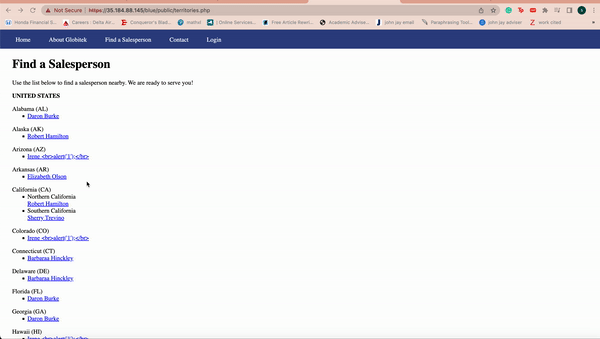
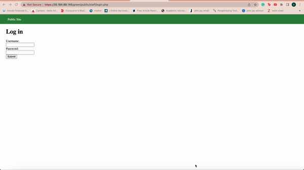
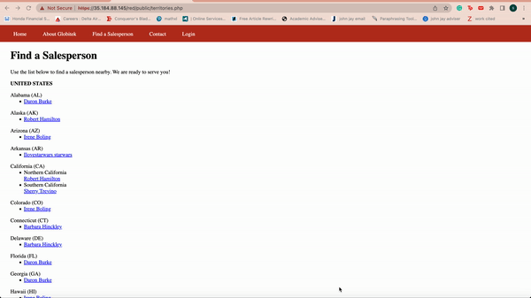

# Pen-Testing-Live-Targets
Time spent: **10** hours spent in total

> Objective: Identify vulnerabilities in three different versions of the Globitek website: blue, green, and red.

The six possible exploits are:

* Username Enumeration
* Insecure Direct Object Reference (IDOR)
* SQL Injection (SQLi)
* Cross-Site Scripting (XSS)
* Cross-Site Request Forgery (CSRF)
* Session Hijacking/Fixation

Each color is vulnerable to only 2 of the 6 possible exploits. First discover which color has the specific vulnerability, then write a short description of how to exploit it, and finally demonstrate it using screenshots compiled into a GIF.

Vulnerability #1: SQL Injection

Description: 
First go to the salesperson then pick any name. After that go to the URL change the query parameter as ```id='``` which displays ```Database query failed```. The input is not being sanitized before being used in an SQL query which is not good.




## Green

Vulnerability #1: Username Enumeration

Description: When you use the correct user name and incorrect password, the ```Log in was unsuccessful``` is bolded. When you use the incorrect user name and incorrect password, the ```Log in was unsuccessful``` is not bolded. This is a username enumeration vulnerability.




## Red

Vulnerability #1: Insecure Direct Object Reference (IDOR)

Description: By changing the id parameter, we can can view a profile that isn't intended to be public (10) till later, as well as a profile of a sacked employee (11). Blue and green circumvent this by redirecting for ids that should not be displayed publicly.




## Notes

Describe any challenges encountered while doing the work
